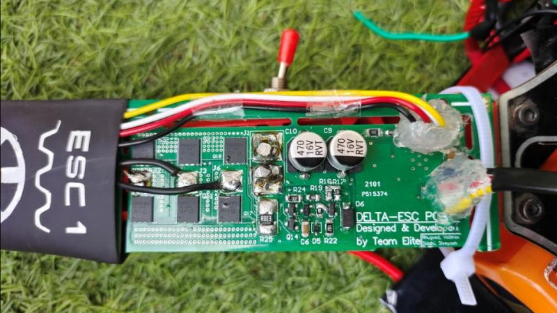

# Quadcopter Embedded Firmware

This repository contains the embedded firmware code developed for the Electronic Speed Controller (ESC), Flight Controller, and Sensorless ESC of a quadcopter. This project was undertaken from July 2021 to June 2022 as my diploma final year project. The firmware includes code for controlling the ESC, flight controller, and an improved sensorless ESC developed post-diploma completion. I took this project to build my development skills as it possessed real-time firmware challenges. The experience taught me various multidisciplinary skills because it required me to understand circuit design, interfacing and the physics of a drone too. It made me realize the importance of quality, reliabily and rigurous testing in product and firmware development as any failure would have lead the drone to crash and potentialy harm people standing in close vicinity.

## Disclaimer

As I upload this project to GitHub along with my other older projects, it's important to note that I am presenting it in its original form, without modifications. Therefore, the concepts and coding style reflect my skills and knowledge as of 2021-22, rather than my current capabilities. Please overlook any technical or logical errors in the project.

## Sections

- [ESC (Electronic Speed Controller)](#esc-electronic-speed-controller)
- [Flight Controller](#flight-controller)
- [Sensorless ESC](#sensorless-esc)
- [Disclaimer](#disclaimer)

## ESC (Electronic Speed Controller)

This section contains the code for the Electronic Speed Controller (ESC) used in the quadcopter. The ESC code controls in real time the switching of power mosfets for motor speed and power delivery. It recieves the speeed requirements from the Flight controller over UART and generates actuation signals accordingly. It includes functions for initializing PWM, enabling and disabling the PWM clock, controlling the stator timer, and managing the high and low sides of the ESC.

### Methods

- `void PWMInit(void);`
- `void EnablePWMClock(void);`
- `void DisablePWMClock(void);`
- `void StatorTimerInit(void);`
- `void ONHighSide(uint8_t HighSide);`
- `void OFFHighSide(uint8_t HighSide);`
- `void ONLowSide(uint8_t LowSide);`
- `void OFFLowSide(uint8_t LowSide);`
- `void StatorFreqUpdate(float StatorONFreqDiff);`
- `void ActivateStator(uint8_t HighSide, uint8_t LowSide);`
- `void USARTInit(void);`
- `void HighSideCapacitorCharge(void);`
- `void Delay_ms(uint16_t NoOfms);`
- `void SetDutyCycle(float StatorONFreq);`
- `void EnableDataRegEmptyInterrupt(void);`
- `void DisableDataRegEmptyInterrupt(void);`

## Flight Controller

This section contains the code for the flight controller, which is responsible for stabilizing the quadcopter and executing control algorithms. The flight controller code includes functions for initializing and reading data from the MPU (Motion Processing Unit), managing timers, handling virtual UART communication, and executing PID control algorithms. The flight controller sends control signals to the ESC over UART and communicates to the MPU over I2C.

### Methods

- `uint8_t GetMPUOrientation(void);`
- `uint8_t ReadMPUData(uint8_t RegAddr, uint8_t NoOfBytes);`
- `void MPU_Init(void);`
- `void SendSlaveAddr(uint8_t RdOrWr);`
- `void SendByte(uint8_t Data, uint8_t ISRegAddr);`
- `void SendStrtByte(uint8_t ISRepeatedStrt);`
- `void SendStopByte(void);`
- `void ReceiveByte(void);`
- `void RequestFirstByte(void);`
- `void WriteMPUData(uint8_t RegAddr, uint8_t NoOfBytes);`
- `void EnableTWIInterrupt(void);`
- `void DisableTWIInterrupt(void);`
- `void VirtualUARTInit(void);`
- `void Delay_ms(uint16_t NoOfms);`
- `void Send_VUART_Data(int16_t AngX, int16_t AngY);`
- `void Send_VUART_Byte(uint8_t Byte);`
- `void StartTimer1(void);`
- `void StopTimer1(void);`
- `void Timer1Init_for_VUART(void);`
- `void StartTimer0(void);`
- `void StopTimer0(void);`
- `void Timer0_Init(void);`
- `void USARTInit(void);`
- `void SendESCData(struct tagESC_Data *ESC_Data);`
- `void DisableDataRegEmptyInterrupt(void);`
- `void EnableDataRegEmptyInterrupt(void);`
- `void AcclRetarESC(uint16_t StartStatOnFreq, uint16_t EndStatOnFreq);`
- `void AutoCalibrate(void);`
- `void ExecuteStepwisePID(void);`
- `void PID(void);`
- `void EnableRXCompleteInterrupt(void);`
- `void DisableRXCompleteInterrupt(void);`
- `void ExecutePID(void);`
- `void AccelarateMotors(void);`
- `void TwoMotorSpeedControl(void);`
- `void AccelarateMotorsAndRoll(void);`
- `void AccelarateMotorsAndRollFixed(void);`

## Sensorless ESC

This section contains the code for a sensorless ESC developed after completing my diploma, before starting my second year of engineering. This ESC is an improvement over the previously developed open-loop ESC, providing faster acceleration, reduced vibrations, and noise. It operates on a closed-loop feedback system that detects rotor position using sensorless back EMF zero-crossing detection feedback principle.

## Circuit Design

This project also included the complete circuit design, design calculations, power dissipation considerations, thermal considerations (including Schematic and PCB Layout) of the Electronic Speed Controller, Flight Controller, and BMS of a Quadcopter. During the course of this project I also had to study and understand the Quadcopter flight dynamics which made me realise that a good developer, aspiring to be an entrepreneur should have expertise in 1-2 fields but at the same time an understanding of related multiple domains too, to be able to develop something which actually solves multiple user pain points.

---
### The image of the Quadcopter

---
### Electronic Speed Controller

---
### ESC PCB

---
### Flight Controller

---
### FC PCB

---
### ESC - Initialization Workflow

---
### ESC - Main Loop Workflow

---
### FC - Initialization Workflow

---
### FC - Main Loop Workflow

---

Feel free to reach out if you have any questions or need further clarification on any part of the code. Thank you for checking out my project!
